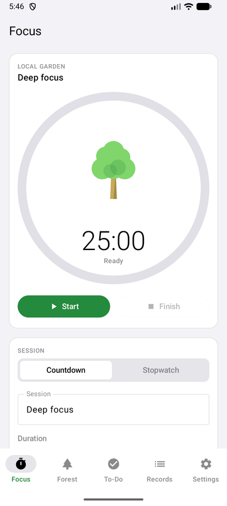
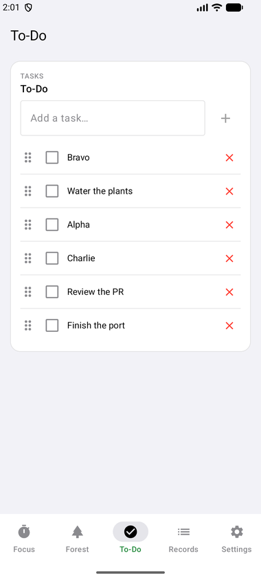
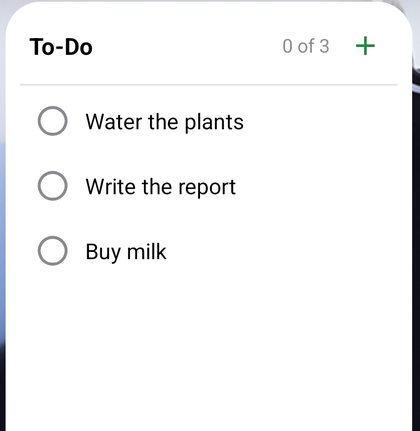
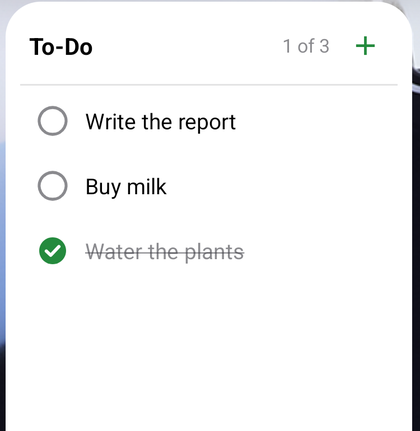

# 🌲 TimberTimer for Android

A native Android port of [TimberTimer](https://github.com/hanifedma/timbertimer), talking
to **the same Supabase project** as the website — a tree planted on the phone is
in the forest on the web when it next loads, and the other way round.

Grab the APK from the [latest release](../../releases/latest), or build it
yourself — both are covered below.

<p align="center">
  
  
</p>
<p align="center">
  
  
</p>

## What it does

Everything the web app does, plus what only a phone can:

| | |
|---|---|
| **Countdown & stopwatch** | Finishing a countdown early records an abandoned session, exactly as on the web. |
| **A tree per session** | Seven species, chosen by tapping the tree rather than reading a dropdown. The name remembers your pick; past sessions keep the tree they were planted with. |
| **Forest** | Today / week / month, with each tree drawn at the size its session earned. |
| **Rest stopwatch** | Plants a wilted tree; rests under a minute are dropped. |
| **To-do list** | Drag by the grip handle to reorder, synced when signed in. |
| **Focus history** | Searchable, filterable, editable, with today/total stats. |
| **Google sync** | The same account, the same four tables, the same rows. |
| **Light / dark / system**, **English / 한국어** | Switchable in Settings. |
| **Runs in the background** | A foreground service keeps the countdown alive and on the lock screen. |
| **Notifications** | Live countdown in the shade, Finish and Give up actions, an alert with a buzz when a session lands, and a quiet nudge when you leave the app with nothing running. |
| **Works offline** | Local-first, with an outbox so a finished session is never lost to a dead network. |
| **Home screen widget** | Your tasks on the wallpaper. Tick one off in place; tap anything else to open the app on the To-Do tab. |
| **Live sync** | A Supabase Realtime socket, so a timer started on another device appears here at once instead of at the next poll. |

## One setup step for Google sign-in

Everything works offline with no setup at all. To make **Google sync** work, the
app's redirect has to be allow-listed once, in the same dashboard the website uses:

> Supabase → your project → **Authentication → URL Configuration → Redirect URLs** →
> add `timbertimer://auth-callback`

Without it Supabase refuses the redirect and sends the browser to the website
instead, so sign-in never comes back to the app. Nothing else needs changing —
the tables and the row-level security policies are already the ones
`docs/supabase-schema.sql` created.

## Two more setup steps, both optional

### Live updates (instead of a 15-second poll)

Supabase only streams changes for tables that are published for replication, and
none of these are by default. Run this once in the SQL editor:

```sql
alter publication supabase_realtime add table public.focus_sessions;
alter publication supabase_realtime add table public.active_focus_timers;
alter publication supabase_realtime add table public.active_rest_timers;
alter publication supabase_realtime add table public.notes;
```

Without it the app still syncs — it falls back to polling every 15 seconds,
exactly as the website does — but changes will not be instant.

**The website is still the slower half of the pair.** `src/app.js` polls on a
15-second timer and does not subscribe to Realtime, so *website → phone* becomes
immediate with the SQL above, while *phone → website* stays up to 15 seconds
behind until the web client is taught to subscribe too. That is a change to the
web repo, not to this one.

## The widget

Long-press the home screen → Widgets → TimberTimer, or use
**Settings → To-Do list → Add the To-Do widget** inside the app, which asks the
launcher to place it for you.

- Tap a **circle** to cross a task off — it strikes through, dims, and drops to
  the bottom without opening anything.
- Tap the **text**, the **header**, or the **+** to open the app on the To-Do
  tab, where tasks can be added, renamed and reordered.

Editing is deliberately not reproduced in the widget: RemoteViews has no text
input and no drag, so anything beyond a checkbox would be a worse version of what
the app already does well.

## Install it

Download the APK from the [latest release](../../releases/latest), open it on the
phone, and allow installing from that source when Android asks — it does not come
from the Play Store, so it will want confirmation once.

Requires **Android 7.0 (API 24)** or newer. Phones, tablets and foldables: the
navigation moves to a side rail and the focus screen splits into two columns once
there is width for it.

## Build it yourself

```bash
./gradlew assembleDebug      # app/build/outputs/apk/debug/
./gradlew assembleRelease    # signed, if keystore.properties is present
./gradlew testDebugUnitTest  # 26 tests
```

`assembleRelease` signs the APK if a `keystore.properties` sits beside this file,
and produces an unsigned one if it does not — the honest outcome rather than a
confusing failure. Neither that file nor the keystore is tracked here:

```properties
storeFile=my-release-key.jks
storePassword=…
keyAlias=…
keyPassword=…
```

Create one with:

```bash
keytool -genkeypair -v -keystore my-release-key.jks -alias timbertimer \
  -keyalg RSA -keysize 4096 -validity 10950
```

**Then keep that `.jks` and its password safe, and out of git.** Android accepts
an update only if it is signed with the same key as the installed version, so
losing it means every user has to uninstall before they can update — and anyone
who obtains it can ship an update the system will trust.

## How it is put together

[`docs/ARCHITECTURE.md`](docs/ARCHITECTURE.md) covers the layout, the testing
setup, and the reasoning behind the decisions that are easy to undo by accident.
The short version:

```
app/src/main/java/com/example/timbertimer/
  core/          Time, and the seeded tree maths ported from the web client
  data/          models, local store, Supabase auth + REST + Realtime, repository
  timer/         the timer engine, foreground service, notifications, sound
  ui/            Compose screens, the eight trees, theme
  widget/        the home screen to-do widget
```

**The timer does not count down.** It stores the instant it ends at, and every
reading is derived from the clock. That is what makes it survive being killed,
dozed, or rebooted without drifting — there is no state to repair on the way
back. A foreground service keeps the process alive and the notification on
screen; an exact alarm is the backstop if the service is ever torn down.

**`core/Seed.kt` is a bit-for-bit port,** including a JavaScript multiply that
overflows 2^53 and loses precision — and the lost bits decide which species a new
session name gets. `SeedParityTest` pins this against values generated by running
the website's own functions under Node, so a forest looks the same on both.

**A Realtime message triggers a full reconcile, not a row patch.** Applying the
deltas would mean a second merge path, exercised only when two devices are in use
at once — precisely the situation where a disagreement between the two would be
hardest to reproduce. One path stays correct; the socket only decides *when* it
runs.

**Two signed-in devices settle a finished session by deleting a row.** Whichever
one removes `active_focus_timers` first is the one that writes the record; the
other finds it gone and steps aside. That is why a failed upload of that row must
never be treated as a success.
