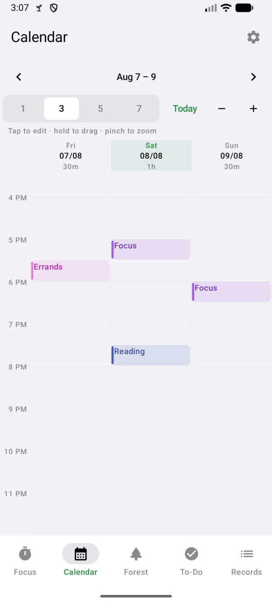
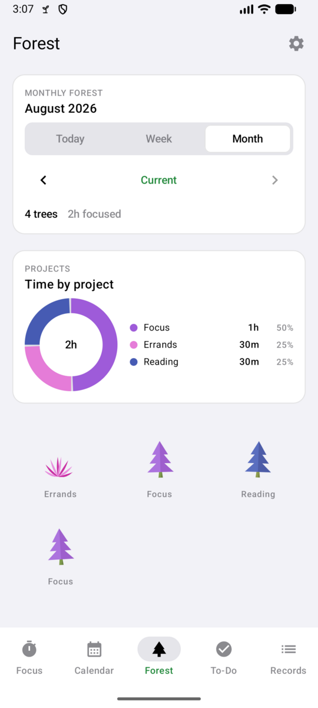
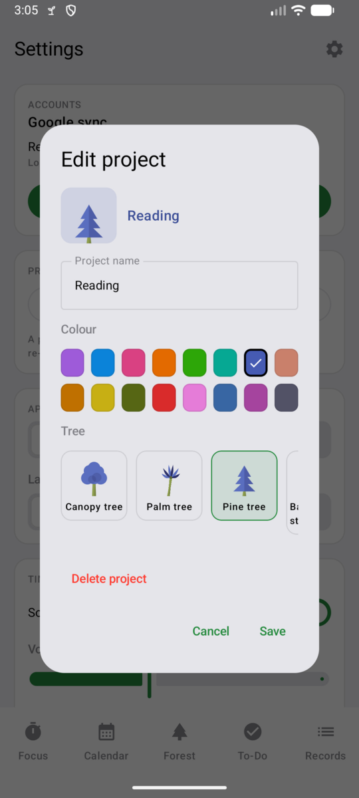

# 🌲 TimberTimer for Android

A native Android port of [TimberTimer](https://github.com/hanifedma/timbertimer), talking
to **the same Supabase project** as the website — a tree planted on the phone is
in the forest on the web when it next loads, and the other way round.

Grab the APK from the [latest release](../../releases/latest), or build it
yourself — both are covered below.

<p align="center">
  
  
  
</p>
<p align="center">
  
  
</p>
<p align="center">
  
  
</p>

## What it does

Everything the web app does, plus what only a phone can:

| | |
|---|---|
| **Countdown & stopwatch** | You still choose how long a countdown runs, but that goal is not written onto the record it leaves behind. A finished session is just when it ran and for how long, so ending one early is not an outcome the history remembers. |
| **Projects** | Every record belongs to one, and the project owns its colour and its tree. Name a new project and both are picked for you; recolour it and its whole forest changes with it. |
| **Calendar** | A day grid showing 1–7 days at once, zoomable by pinch. Tap empty space to add a record, hold a block to drag it to another time or another day, or grab its top or bottom edge to change when it started or ended. A drag is read back to you before it is saved, so a block nudged by accident costs nothing. |
| **Time by project** | A donut and a breakdown of where the day's, week's or month's hours actually went, in each project's colour. |
| **Tasks remember their project** | Track "wash dishes" under Errands once and choosing that task picks Errands again by itself, on any device. |
| **A tree per project** | Seven species, chosen by tapping the tree rather than reading a dropdown. Records are drawn with whatever their project grows now, so changing it re-plants the forest. |
| **Forest** | Day / week / month, each steppable backwards, with every tree drawn at the size its session earned and in its project's colour. |
| **Rest timer** | 5 / 10 / 15 minutes or any length you type, with a stubborn alarm when it lands — see below. Or run it open-ended, the way it always did. Rest is a project like any other, so a rest can also be added by hand; rests under a minute are dropped. |
| **To-do list** | Drag by the grip handle to reorder, synced when signed in. |
| **Focus history** | Searchable, editable, with today/total stats. |
| **Google sync** | The same account, the same five tables, the same rows — through Android's own account sheet, so the prompt names this app rather than a Supabase address. |
| **Light / dark / system**, **English / 한국어** | Switchable in Settings. |
| **Runs in the background** | A foreground service keeps the countdown alive and on the lock screen — and, with background sync on, keeps this device listening for changes even with the app closed. Starts itself after a reboot. |
| **Notifications** | Live countdown in the shade with a Finish action, an alert with a buzz when a session lands, and a quiet nudge when you leave the app with nothing running. |
| **Works offline** | Local-first, with an outbox so a finished session is never lost to a dead network. |
| **Home screen widget** | Your tasks on the wallpaper. Tick one off in place; tap anything else to open the app on the To-Do tab. |
| **Live sync** | A Supabase Realtime socket, so a timer started on another device appears here at once instead of at the next poll. |

## One setup step for Google sign-in

Everything works offline with no setup at all. To make **Google sync** work, the
app's redirect has to be allow-listed once, in the same dashboard the website uses:

> Supabase → your project → **Authentication → URL Configuration → Redirect URLs** →
> add `timbertimer://auth-callback`

Without it Supabase refuses the redirect and sends the browser to the website
instead, so sign-in never comes back to the app.

**Re-run the schema before installing this version.** Paste all of the web repo's
`docs/supabase-schema.sql` into the SQL editor and run it. A record no longer
stores a goal or an outcome, so `focus_sessions.duration_minutes` and
`focus_sessions.status` are gone — and both were `not null`, so a client that has
stopped writing them cannot save a session until the script has run. It is safe
to re-run, and it does the migration in the right order: it writes each
pre-projects record's project down first (the last thing `status` was needed
for), then drops the columns. `active_focus_timers` is untouched — a running
countdown still needs to know when it ends. The same script is what adds the
`projects` table and the `project_id` columns, so a database that never had those
gets them here too.

### Signing in without leaving the app (optional, recommended)

With only the step above, signing in hands off to a browser and returns through
Supabase's callback — so Google's prompt names `<project>.supabase.co` rather
than this app. That address is a property of the redirect, not of any branding
setting, so it cannot be renamed; the only way to be rid of it is not to redirect
at all.

Asking Google for an ID token on the device does exactly that: Android's own
account sheet appears, carrying this app's name and icon, and Supabase is never
mentioned. Three things have to line up:

1. **Google Cloud Console → APIs & Services → Credentials → Create credentials →
   OAuth client ID → Android.** Package name `com.example.timbertimer`, and the
   SHA-1 of whichever certificate signs the build you install. This entry is what
   authorises the app to ask; it does not replace the web client. **This is the
   step that is usually missing**, and it is the whole reason sign-in ends up in
   a browser. Create it in the *same* Google Cloud project as the web client
   below — a client in some other project does not count.

   The two fingerprints for this repo, so there is nothing to look up:

   | Build | SHA-1 |
   | --- | --- |
   | Release (`timbertimer-release.jks`) | `F1:96:FC:7C:A5:44:B9:22:E6:D4:16:55:D0:43:33:CB:5B:86:1A:9F` |
   | Debug (`~/.android/debug.keystore`) | `3D:29:58:C6:75:80:7A:A5:49:1F:A4:D2:56:1F:FB:8B:BB:2B:0D:A6` |

   Register **both** if you install both. They are separate certificates, so an
   Android client for one says nothing about the other. Regenerate them any time
   with `keytool -list -v -keystore <file> -alias <alias>`.
2. **`SupabaseConfig.GOOGLE_WEB_CLIENT_ID`** must hold the *web* client id — the
   same one the website puts in `src/supabase-config.js`. It is the audience of
   the token, and a client id is public by design.
3. **Supabase → Authentication → Providers → Google → Authorized Client IDs** must
   list that web client id, which is what lets Supabase accept the token.

Anything missing — an unregistered certificate, no Play Services, no Google
account on the phone — and the app falls back to the browser redirect, which
keeps working exactly as before. It now says which of those it hit before doing
so, because a silent fallback made a five-minute console fix look like the app's
normal behaviour.

## Two more setup steps, both optional

### Live updates (instead of a 15-second poll)

Supabase only streams changes for tables that are published for replication, and
none of these are by default. Run this once in the SQL editor:

```sql
alter publication supabase_realtime add table public.focus_sessions;
alter publication supabase_realtime add table public.active_focus_timers;
alter publication supabase_realtime add table public.active_rest_timers;
alter publication supabase_realtime add table public.notes;
alter publication supabase_realtime add table public.projects;
```

Deletes need one thing more. On a table with row level security, a DELETE
carries only the primary key unless the table keeps a full copy of the old row —
so `user_id` is absent, the subscription's filter and the security policy cannot
be evaluated, and the event is dropped. Inserts and updates arrive; deletions do
not. To fix that:

```sql
alter table public.focus_sessions replica identity full;
alter table public.active_focus_timers replica identity full;
alter table public.active_rest_timers replica identity full;
alter table public.notes replica identity full;
alter table public.projects replica identity full;
```

Without any of this the app still syncs — it falls back to polling every 15
seconds — but changes will not be instant.

**The website is still the slower half of the pair.** `src/app.js` polls on a
15-second timer and does not subscribe to Realtime, so *website → phone* becomes
immediate with the SQL above, while *phone → website* stays up to 15 seconds
behind until the web client is taught to subscribe too. That is a change to the
web repo, not to this one.

## Staying current in the background

By default the app keeps a foreground service running whenever it is installed,
not only while a timer is going. That service is what holds the live sync
connection open — and without it the process dies with the last open screen, so a
task ticked on one device could sit unnoticed in another device's widget until
something opened the app there.

The price is a permanent quiet notification, which the platform charges for the
privilege. **Settings → Keep syncing in the background** turns it off if you would
rather have the notification back and sync only while the app is open.

It restarts itself after a reboot, and **Settings → Ignore battery optimisation**
opens Android's own exemption dialog. Be aware that no app can truly be immune:
several manufacturers stop background work regardless of what that dialog says,
and that is a decision made below the app.

### The rest alarm

A break that ends quietly is a break that becomes an hour, so the end of a rest
countdown is treated as an alarm rather than as a notification — and it is built
to get through the five things that normally swallow one:

| | |
|---|---|
| **Silent mode** | The tone and the buzz are both played as *alarms*, which is the class Android exempts from the ringer being off. |
| **Do Not Disturb** | The alarm is filed under `CATEGORY_ALARM`, which DND's own "allow alarms" rule lets through by default. **Settings → Allow alerts in Do Not Disturb** adds the channel-level bypass on top. |
| **Battery saver / Doze** | An exact alarm is scheduled for the instant the rest ends, and a wake lock is held while it rings. |
| **The app being killed** | That alarm fires whether or not the app is still running, and re-starts it. |
| **A locked, dark screen** | It turns the screen on and shows itself over the lock screen, the way a clock alarm does. On Android 14+ that needs **Settings → Show rest alarm over the lock screen**; without it, the alarm still sounds and still appears in the shade. |

It rings for two minutes and then falls quiet — deliberately finite, because the
usual reason an alarm goes unanswered is a phone left on a desk two rooms away,
and something that shrieks for an hour gets switched off for good. What survives
the two minutes is the notification, which **cannot be swiped away**: only
*Dismiss* (or opening the app) clears it.

**Settings → Rest alarm** chooses sound, buzz, both, or silent, and auditions
the choice as you make it. It is a separate setting from the timer sound on
purpose: muting the chime that ends a focus session says nothing about whether
you want to sleep through the end of a break.

Nothing here can run away with your phone. The looping tone and the repeating
vibration both belong to the app's own process and stop when it does, so the
worst failure is silence rather than a device that will not shut up.

### A clock you can read from across the desk

The platform files a notification's elapsed time next to the timestamp, in the
header, at header size — sensible for a chat message, wrong for a focus timer
where the clock *is* the content. That text cannot be resized, so the running
notification replaces the content area with its own: the time large and in the
app's green, the task above it, the goal below, and the progress bar under that.

`DecoratedCustomViewStyle` is what keeps this from being a step backwards. The
platform still draws the header, the app name, the expander and the action
button, so Finish looks and behaves exactly as it always did, and only the middle
is ours — rather than a fully custom notification that would have had to
reimplement all of it, badly, and differently on every OEM skin.

The clock still ticks by itself. A RemoteViews `Chronometer` counts from
`SystemClock.elapsedRealtime()` rather than the wall clock, so the target instant
is converted into that frame each time the notification is built — no drift
accumulates, and because elapsedRealtime includes time the device spent asleep, a
phone dozing in a pocket for an hour wakes with the clock still right.

The stopwatch and the rest timer use the same layout with the progress bar
hidden, because neither has a goal for a bar to measure.

### The clock that runs when nothing else does

With no timer and no stopwatch going, the notification counts *up* from the end
of your last session — the same platform chronometer the running timer uses,
pointed the other way. "1h 30m since your last session", ticking, with today's
total and a **Start focusing** button behind the expander.

It is a clock on the wall, not a session: nothing about it is recorded, synced,
or stored, and it never becomes a row in the database. It exists to make the gap
visible, because a number you can see is a better argument for starting again
than a notification that just says the app is running.

Three details it gets right:

- **It costs nothing to run.** The chronometer counts on its own from one instant
  handed to it once, so it stays exact for days with the process dead. Only the
  sentence beside it needs reposting, and that happens once a minute.
- **It coarsens as it grows.** Under a day it ticks. Past a day the seconds stop
  meaning anything and a ticking `74:12:31` reads as a scolding, so it switches
  to "3 days since your last session" and shows the date of the last one instead.
- **It knows when to say something else.** On a fresh install there is no gap to
  count, so it offers the first tree rather than a zero. Rests are not sessions,
  so resting does not reset it. And a session planted into the calendar for
  tomorrow is a plan, not a thing done — those are ignored, or the clock would
  run backwards.

With background sync off, the standalone reminder carries the same chronometer
but not the same sentence: there is no service to repost it, and a body reading
"20m" beside a header reading 4:31:07 would be worse than no body at all.

### Notifications that stay put

A notification describing something that is still happening should not disappear
while it is still happening. Three things keep that true:

- **Swiping the ongoing one away puts it back.** From Android 14 even an ongoing
  foreground-service notification can be flicked aside, and doing so does not
  stop the timer or close the sync connection — so the shade would be left
  claiming the app is idle while it is doing the opposite. It alone carries a
  delete intent that reposts it. The way out is never blocked: finishing the
  timer or turning **Keep syncing in the background** off removes the reason, and
  with it the notification.

  This does not extend to the other two. The finished-session alert announces
  something that has already happened, and the idle nudge is an invitation —
  neither reports on anything still running, so a swipe means what it says and
  they stay gone. An alert that came back from being dismissed would be one there
  is no way to be rid of at all. The nudge returns the next time there is
  something new to say, and **Remind me when nothing is running** still silences
  it for good.
- **A quarter-hourly heartbeat.** A vendor battery manager that stops the service
  used to take the notification with it, silently, until something opened the
  app. An alarm now checks, restarts the service and reposts. It is exact only
  while a timer is running; with nothing but sync at stake it is left inexact so
  Doze can batch it. The service also re-checks whenever battery saver toggles,
  Doze lifts, or the screen comes on.
- **Do Not Disturb.** `Settings → Allow alerts in Do Not Disturb` opens Android's
  policy-access screen. An app cannot grant itself this, and until it is granted
  the platform ignores the request on every channel — so the app only asks. Once
  granted, the channels are rebuilt with the bypass set (it can only be chosen as
  a channel is created, never afterwards), and a finished session chimes even
  with the phone silenced.

## The widget

Long-press the home screen → Widgets → TimberTimer, or use
**Settings → To-Do list → Add the To-Do widget** inside the app, which asks the
launcher to place it for you.

- Tap a **circle** to cross a task off — it strikes through, dims, and drops to
  the bottom without opening anything.
- Tap the **text**, the **header**, or the **+** to open the app on the To-Do
  tab, where tasks can be added, renamed and reordered.

Editing is deliberately not reproduced in the widget: RemoteViews has no text
input and no drag, so anything beyond a checkbox would be a worse version of what
the app already does well.

## Install it

Download the APK from the [latest release](../../releases/latest), open it on the
phone, and allow installing from that source when Android asks — it does not come
from the Play Store, so it will want confirmation once.

Requires **Android 7.0 (API 24)** or newer. Phones, tablets and foldables: the
navigation moves to a side rail and the focus screen splits into two columns once
there is width for it.

## Build it yourself

```bash
./gradlew assembleDebug      # app/build/outputs/apk/debug/
./gradlew assembleRelease    # signed, if keystore.properties is present
./gradlew testDebugUnitTest  # 53 tests
```

`assembleRelease` signs the APK if a `keystore.properties` sits beside this file,
and produces an unsigned one if it does not — the honest outcome rather than a
confusing failure. Neither that file nor the keystore is tracked here:

```properties
storeFile=my-release-key.jks
storePassword=…
keyAlias=…
keyPassword=…
```

Create one with:

```bash
keytool -genkeypair -v -keystore my-release-key.jks -alias timbertimer \
  -keyalg RSA -keysize 4096 -validity 10950
```

**Then keep that `.jks` and its password safe, and out of git.** Android accepts
an update only if it is signed with the same key as the installed version, so
losing it means every user has to uninstall before they can update — and anyone
who obtains it can ship an update the system will trust.

## How it is put together

[`docs/ARCHITECTURE.md`](docs/ARCHITECTURE.md) covers the layout, the testing
setup, and the reasoning behind the decisions that are easy to undo by accident.
The short version:

```
app/src/main/java/com/example/timbertimer/
  core/          Time, the calendar's layout maths, and the colour and species
                 arithmetic ported bit-for-bit from the web client
  data/          models, local store, Supabase auth + REST + Realtime, repository
  timer/         the timer engine, foreground service, notifications, sound
  ui/            Compose screens, the eight trees, theme
  widget/        the home screen to-do widget
```

**The timer does not count down.** It stores the instant it ends at, and every
reading is derived from the clock. That is what makes it survive being killed,
dozed, or rebooted without drifting — there is no state to repair on the way
back. A foreground service keeps the process alive and the notification on
screen; an exact alarm is the backstop if the service is ever torn down.

**`core/Seed.kt` and `core/Palette.kt` are bit-for-bit ports,** including a
JavaScript multiply that overflows 2^53 and loses precision — and the lost bits
decide which colour and which species a new project name gets. CSS rounds every
component of an `hsl()` to a whole number, so that rounding is reproduced too.
`SeedParityTest` pins all of it against values generated by running the website's
own functions under Node, so a project named "Reading" is the same indigo pine on
the phone as on the web.

**The calendar's layout is a plain Kotlin function.** Splitting a session that
runs past midnight into two blocks, and packing overlapping ones into columns, is
where a day grid actually goes wrong — and both are far easier to pin down in
`CalendarLayoutTest` than by dragging blocks around on a device. The screen is
left with placing rectangles and reading gestures.

**A Realtime message triggers a full reconcile, not a row patch.** Applying the
deltas would mean a second merge path, exercised only when two devices are in use
at once — precisely the situation where a disagreement between the two would be
hardest to reproduce. One path stays correct; the socket only decides *when* it
runs.

**Two signed-in devices settle a finished session by deleting a row.** Whichever
one removes `active_focus_timers` first is the one that writes the record; the
other finds it gone and steps aside. That is why a failed upload of that row must
never be treated as a success.
